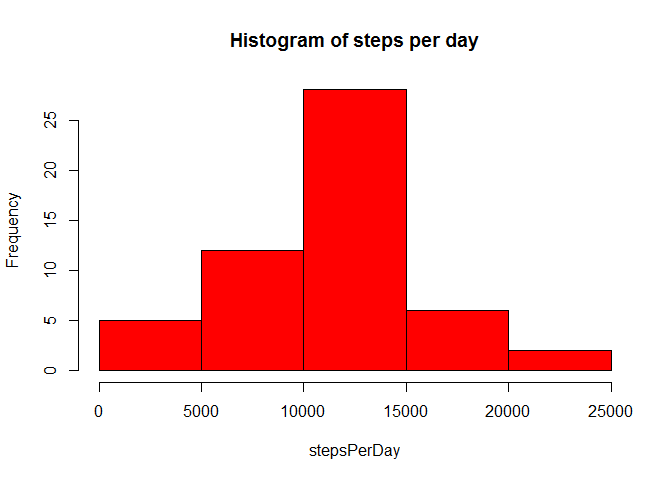
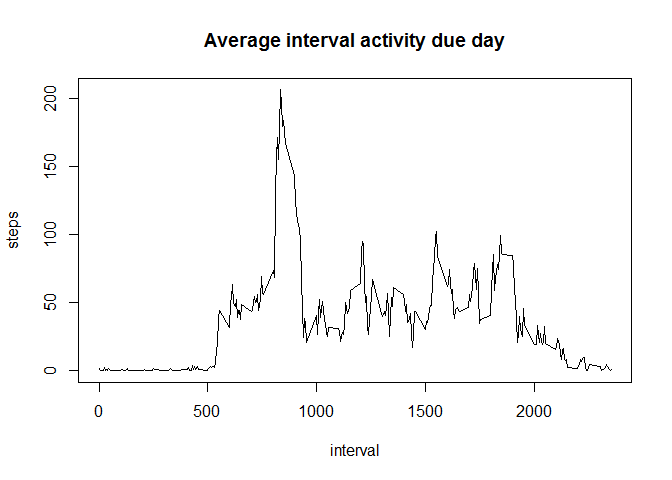
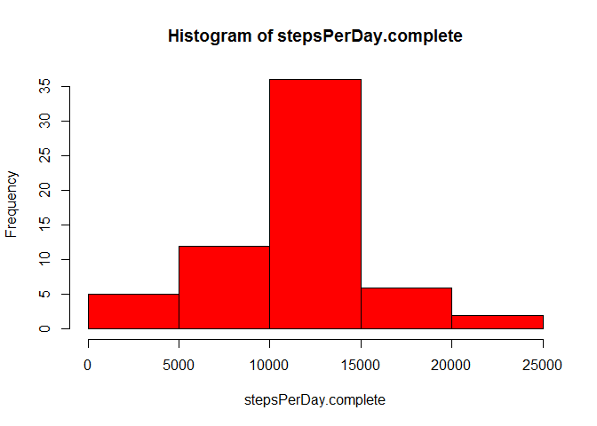
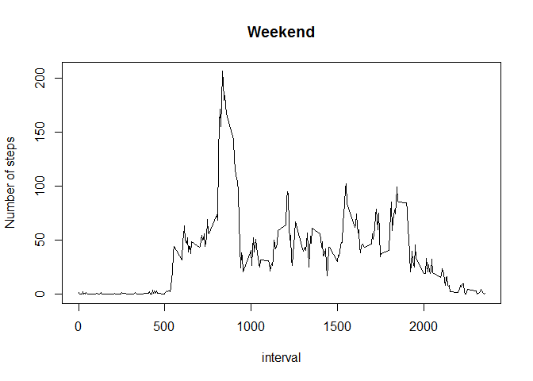
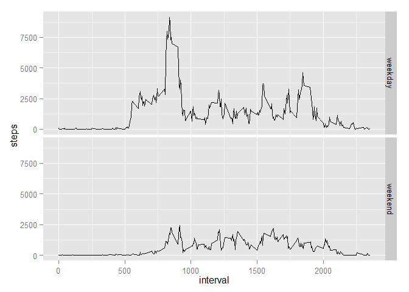

# Reproducible Research: Peer Assessment 1


## Loading and preprocessing the data
setting __filePath__ and reading the table:

```r
filePath <- "activity.csv"
activity <- read.table(filePath, na.strings='NA', sep=',', header=T, 
                       colClasses=c("numeric","Date","numeric") )
```

## What is mean total number of steps taken per day?


```r
stepsPerDay <- tapply(activity$steps,activity$date, sum)

# histogram of the total number of steps taken each day
hist(stepsPerDay,col='red',main = "Histogram of steps per day")
```

 

mean steps per day: 

```r
meanPerDay <- mean(stepsPerDay,na.rm=T)
meanPerDay
```

```
## [1] 10766.19
```
median steps per day:

```r
medianPerDay <- median(stepsPerDay,na.rm=T)
medianPerDay
```

```
## [1] 10765
```


## What is the average daily activity pattern?

```r
# creating time series 5-minute intervals
meanStepsPerInterval <- aggregate(steps ~ interval, data = activity,
                                  FUN = mean,
                                  na.rm = T)

#plotting 5-minute interval (x-axis) and the average number of steps taken,
#averaged across all days (y-axis)
plot(meanStepsPerInterval,
     type = "l",
     main = "Average interval activity due day")
```

 

5-minute interval contains the maximum number of steps

```r
maxInterval <- meanStepsPerInterval$interval[match(max(
  meanStepsPerInterval$steps),meanStepsPerInterval$steps)]
maxInterval
```

```
## [1] 835
```

## Imputing missing values
number of rows with missing values


```r
missing <- sum(!complete.cases(activity))
missing 
```

```
## [1] 2304
```

filling in all of the missing values in the dataset (using mean 5-minute intervals)

```r
activity.complete <- activity
na.steps<-is.na(activity.complete$steps)
activity.complete$steps[na.steps] <- meanStepsPerInterval$steps[
  match(activity.complete$interval[na.steps],meanStepsPerInterval$interval)]
```
Histogram of the total number of steps taken each day

```r
# histogram of the total number of steps taken each day
stepsPerDay.complete <- tapply(activity.complete$steps,activity.complete$date, sum)
hist(stepsPerDay.complete, col='red')
```

 

####Mean and median after filling missing value
mean:

```r
meanPerDay.complete <- mean(stepsPerDay.complete,na.rm=T)
meanPerDay.complete
```

```
## [1] 10766.19
```
median:

```r
medianPerDay.complete <- median(stepsPerDay.complete,na.rm=T)
medianPerDay.complete
```

```
## [1] 10766.19
```
The mean number of steps taken per day are the same, but median are different. Probably reason in filling missing value by mean of 5-minute intervals.

### Are there differences in activity patterns between weekdays and weekends?

Creating new factor variable __day__:

```r
activity$day <- "weekday"
activity$day[weekdays(activity$date) %in% c("Saturday","Sunday")] <- "weekend"

# splitting activity by day variable
activityByDay <-split(activity,activity$day)
```

Plotting number of steps depending on day of week


```r
plot(aggregate(steps ~ interval, data = activityByDay$weekday,  mean,na.rm = T),
      type="l",
      main="Weekend",
      ylab="Number of steps"
     )
```

 


```r
plot(aggregate(steps ~ interval, data = activityByDay$weekday, mean,na.rm = T),
  type="l",
  main="Weekday",
  ylab="Number of steps")
```

 


